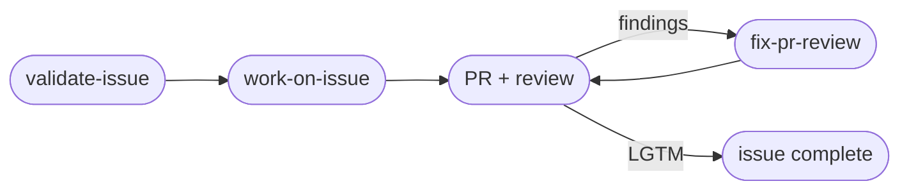

# rk-skills

Richard Kuo's personal [Claude Code](https://claude.com/claude-code) skills — the custom skills, global instructions, and slash command I use across every session.

The real files live in this repo. On my machine they're symlinked into `~/.claude`, so editing in either place is the same file and a `git commit` here captures the change. Third-party / marketplace-installed skills are deliberately excluded — they're reinstallable and not authored by me.

## Skills

Most workflow skills come in two forms: a **base** skill that does one step, and a **`-loop`** variant that drives the whole thing autonomously through review to a merged PR.



- **Issues** — `new-issue`, `validate-issue`, `work-on-issue` (+ `-loop` variants): file a fully-specified, complexity-scored issue; verify its claims against the actual code; implement it end-to-end in an isolated worktree and open a PR.
- **PR review** — `fix-pr-review` (+ `-loop`): re-validate every review finding against the code, fix the ones that hold, push, and re-trigger review until approved.
- **Docs & release** — `sync-docs`, `sync-docs-release`, `create-release`: refresh `CLAUDE.md`/`README`/`SKILL.md` from recent commits, and cut versioned GitHub releases.
- **Fable-driven** — `fableplan`, `fable-validate`, `fable-new-issue` (+ `-loop` variants): delegate planning / validation / issue-drafting to a Fable 5 subagent, then build with your main-session model.

Also included:

- `CLAUDE.md` — my global instructions for all Claude Code sessions (linked to `~/.claude/CLAUDE.md`). Many skills above are tuned to the conventions defined here (attribution footers, complexity scores, the branch+PR workflow).
- `commands/commit.md` — the `/commit` slash command (linked to `~/.claude/commands/commit.md`).

## Install (as a plugin)

This repo is a Claude Code plugin marketplace. In any Claude Code session:

```
/plugin marketplace add richkuo/rk-skills
/plugin install rk-skills@rk-skills
```

Claude Code auto-discovers everything under `skills/` (and the `/commit` command). `CLAUDE.md` is my personal global config and is **not** installed by the plugin — treat it as a reference. Restart Claude Code (or start a new session), then trigger any skill by name, e.g. `/fableplan <task>`.

Prefer to install a single skill? Each is just a directory with a `SKILL.md`, so you can copy one in directly:

```sh
mkdir -p ~/.claude/skills/work-on-issue && \
  curl -fsSL https://raw.githubusercontent.com/richkuo/rk-skills/main/skills/work-on-issue/SKILL.md \
  -o ~/.claude/skills/work-on-issue/SKILL.md
```

## Install (with npx)

Copy every skill into your personal `~/.claude/skills/` with one command — no marketplace, no clone:

```sh
npx rk-skills
```

Add `--project` to install into the current repo's `.claude/skills/` instead. This path is copy-based — re-run it to update — whereas the plugin above auto-updates. It installs the **skills only**; not `CLAUDE.md` (my personal global config) or the `/commit` command.

## Restore on a new machine (my setup)

Clone this repo, then run `./install.sh`. It symlinks every tracked item into `~/.claude`, backing up any existing real file to `<name>.bak` first. It only ever replaces symlinks — it never deletes your data.

```bash
git clone git@github.com:richkuo/rk-skills.git ~/Work/rk-skills
cd ~/Work/rk-skills && ./install.sh
```

## License

MIT — see [LICENSE](./LICENSE).
