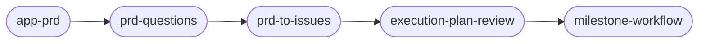

# rk-skills

Workflow skills for [Claude Code](https://claude.com/claude-code) — automate GitHub issues, PR review loops, docs syncing, and releases.

[](https://www.npmjs.com/package/rk-skills)

A "skill" is a reusable instruction file that teaches Claude Code how to do one job well (like filing a GitHub issue or cutting a release). You trigger one by name, and Claude follows its steps.

## Skills

Most workflow skills come in two forms: a **base** skill that does one step and stops, and a **`-loop`** variant that keeps going on its own — through code review and re-review — until the pull request (PR) is approved.


Several skills mention a **complexity score** (`C0`–`C100`): a model + effort routing signal in the issue title. **Capability** (which LLM / whether a Fable plan runs first) lives in the score band; **Volume** (how hard to push) lives in the depth inside the band — see `validate-issue` step 6. "Fable" skills hand part of the work to a subagent running on the Fable 5 model — a second Claude instance that plans, validates, or drafts while your main session does the building.

### Issue skills

| Skill | What it does |
|-------|--------------|
| `new-issue` | Turns a bug, idea, or conversation into a complete GitHub issue. Checks the claims against the actual code first, adds a complexity score, and never files a half-empty stub. |
| `new-issue-loop` | Runs `new-issue`, then automatically validates the new issue, implements it, and drives the PR through review — one command from idea to reviewed PR. Stops early if it finds a duplicate issue. |
| `validate-issue` | Fact-checks an existing issue: verifies every claim against the real code (with file and line references), and checks that the proposed approach is feasible and self-consistent. |
| `github-issue-format` | Reference skill: the required format for creating or editing any GitHub issue (`[C<score>]` title, complexity rationale line, complete-body rule). Loaded automatically before an issue is filed or edited. |
| `validate-issue-loop` | Runs `validate-issue`, applies any fixes the verdict calls for to the issue itself, then hands off to `work-on-issue-loop`. Stops instead if the issue is too large, infeasible, or already fixed elsewhere. |
| `work-on-issue` | Implements an issue end-to-end: builds the fix in an isolated git worktree (a separate working copy, so your main checkout stays untouched), verifies it, and opens a PR that closes the issue. |
| `work-on-issue-loop` | Runs `work-on-issue`, requests a code review, then keeps fixing whatever the review finds until the PR gets an approval ("LGTM" — looks good to me). |

### PR review skills

| Skill | What it does |
|-------|--------------|
| `fix-pr-review` | Reads all unaddressed feedback on a PR — review comments, inline threads, and any failing CI checks — re-checks each point against the actual code (never blindly applies a suggestion), fixes what holds up, resolves any merge conflicts with the base branch, pushes, replies point-by-point, and requests a fresh review. |
| `fix-pr-review-loop` | Repeats `fix-pr-review` after every new review until the PR is approved, and won't stop on an approval while the PR is still unmergeable. After 5 review rounds it accepts the first approval even if minor, non-blocking notes remain. |
| `pr-review-format` | Reference skill: the required format for any PR review comment (verdict line, section structure, materiality filter, safety carve-out). Every finding must include a plain-simple-English summary; `Requires Human Review` items must also include a recommended proposed solution. Loaded automatically before a review is written. |

### Docs & release skills

| Skill | What it does |
|-------|--------------|
| `sync-docs` | Updates `CLAUDE.md`, `AGENTS.md`, `SKILL.md`, and `README.md` to match what recent commits actually changed. |
| `create-release` | Cuts a version tag and publishes a GitHub release with generated notes, bumping the package version first so publish workflows fire correctly. |
| `sync-docs-release` | The two above in sequence: sync docs, commit, then cut the release. |

### Fable-driven skills

| Skill | What it does |
|-------|--------------|
| `fableplan` | Has a Fable 5 subagent write an implementation plan before you build; posts the plan to the related issue if there is one. |
| `fable-new-issue` | Like `new-issue`, but a read-only Fable 5 subagent researches and drafts the issue; your main session spot-checks and files it. |
| `fable-new-issue-loop` | Runs `fable-new-issue`, then drives the new issue all the way to a reviewed PR automatically. |
| `fable-validate` | Like `validate-issue`, but the fact-checking runs on a Fable 5 subagent; your main session presents the verdict and acts on it. |
| `fable-validate-loop` | Runs `fable-validate`, applies issue fixes, gets a Fable plan (only when Capability ≥ 2 / score ≥ 50, or touching safety-critical code), then drives to a reviewed PR. |
| `fable-validate-fableplan-loop` | Same as above, but the Fable plan is unconditional — every issue gets a posted plan before implementation, no matter how simple. |
| `validate-fableplan-loop` | The hybrid: validates on your session's own model, but still brings in Fable for planning when Capability ≥ 2 / score ≥ 50 or safety-flagged, then drives to a reviewed PR. |
| `fableplan-work-on-issue` | The trimmed chain: Fable 5 plans the issue and posts the plan, then `work-on-issue` builds it and opens a PR. No validation, no review loop — stops at the open PR. |
| `fableplan-loop` | Same as above, plus the review loop: after the Fable plan is posted, `work-on-issue-loop` builds it, opens the PR, and keeps fixing review findings until approval. No validation. |
| `fable-advisor` | Runs on your session's own model (Sonnet, typically). A persistent Fable 5 advisor writes the plan and stays available for mid-build consults (hard-to-reverse decisions, stuck signals, plan deviations); a separate fresh Fable 5 reviewer issues a binding pre-commit verdict. |
| `fable-orchestrate` | Runs on Fable 5. Decomposes the task into self-contained worker specs, dispatches Sonnet 5 workers to implement them, reviews each result inline, integrates everything into one branch, and gets a binding verdict from a fresh Fable 5 reviewer before opening the PR. |

### App pipeline skills

The full path from a raw app idea to a running multi-agent build, with a user checkpoint between every stage:



| Skill | What it does |
|-------|--------------|
| `new-app-pipeline` | The orchestrator: idea → PRD → resolved questions → issues → execution-plan review → milestone workflow, stopping at every stage boundary for your review. Re-enterable mid-pipeline when artifacts already exist. |
| `app-prd` | Turns an idea dump into a complete, section-numbered `PRD.md` landed via worktree + PR (bootstrapping an empty repo when needed), then iterates on the same PR as you refine. |
| `prd-questions` | "Ask me all questions": sweeps the PRD for every open question and ambiguity, asks them in batched multiple-choice form with a recommended option, folds each answer into the owning spec section, and empties the Open Questions list. |
| `prd-to-issues` | Breaks the refined PRD into dependency-ordered milestones and 15–25 complete, complexity-scored issues, each stamped with an `## Execution` block: hard `Depends on` prerequisites, ordering-only `Runs after` constraints, build model, effort, whether a Fable plan comes first, and the `@claude` review trigger. |
| `execution-plan-review` | Renders the ordering/model/effort/fableplan table from the issues themselves, takes revisions ("11 should be medium", "12 runs after 11"), rejects cycles across both edge kinds, and writes changes back to the issues. |
| `milestone-workflow` | Reads typed ordering fields before legacy prose, labels inferred edges, builds dependency tracks for a milestone, presents the run plan for approval (mandatory), then runs `milestone-pipeline` and reports PRs, blocked descendants, and review outcomes. |

Every new issue records direct predecessors as `**Depends on:** #<n>[, #<n>…] | none` for required code/product results and `**Runs after:** #<n>[, #<n>…] | none` for serialization without code inheritance. The `workflows/milestone-pipeline.js` dynamic workflow validates the full dependency graph before starting. Typed tracks use `after` for hard prerequisites and `runsAfter` for ordering-only predecessors. Unrelated tracks run concurrently; both successor types wait for stable predecessor review results. Hard successors build from verified predecessor heads, including a checked integration base for multiple heads, while ordering-only successors inherit no code. Legacy array tracks remain compatible and treat serial edges as hard dependencies. Bun regression tests execute the workflow through its async harness.

### Review bot prerequisite

The PR-review skills (`fix-pr-review`, all `-loop` variants) depend on an automated reviewer that responds to `@claude review` comments and answers in a specific format (an `LGTM` / `Needs Updates` verdict plus structured findings). This repo ships two options:

- **Full bundle (recommended): [`templates/claude-workflow/`](./templates/claude-workflow/)** — the complete least-privilege setup: `@claude review` (read-only), any other `@claude ...` comment on a trusted-author PR (re-validate and fix all review feedback in place, folding in any extra text as additional scope), plain `@claude` asks on an issue (implement via the issue-workflow prompt), optional docs/release flows, prompt files, comment-patching scripts, and regression tests. The agent never executes the project's code in any mode (no test suites, builds, or scripts — CI owns checks). See its [README](./templates/claude-workflow/README.md) for install and triggers.
- **Minimal: [`templates/claude-review.yml`](./templates/claude-review.yml)** — a single review-only workflow; copy it into `.github/workflows/`, add an `ANTHROPIC_API_KEY` secret, and the bot and skills speak the same format out of the box.

Without a review bot, the loop skills detect its absence and stop instead of waiting for a review that never arrives.

Grab the workflow directly into a repo:

```sh
mkdir -p .github/workflows && \
  curl -fsSL https://raw.githubusercontent.com/richkuo/rk-skills/main/templates/claude-review.yml \
  -o .github/workflows/claude.yml
```

Also included:

- `CLAUDE.md` — an example set of global instructions these skills are tuned for (attribution footers, complexity scores, the worktree+PR workflow). Use it as a reference for your own `~/.claude/CLAUDE.md`.
- `commands/commit.md` — a `/commit` slash command for creating well-formed git commits.

## Install (with npx)

Copy every skill into your personal `~/.claude/skills/` with one command — no marketplace, no clone:

```sh
npx rk-skills
```

Add `--project` to install into the current repo's `.claude/skills/` instead. This path is copy-based — re-run it to update — whereas the plugin below auto-updates. It installs the **skills, their subagent files, and any dynamic workflow scripts** (a few skills delegate their work to helper agents in `agents/`, which land in `~/.claude/agents/`; the `milestone-workflow` skill invokes a dynamic workflow script from `workflows/`, which lands in `~/.claude/workflows/`); it does not install `CLAUDE.md` (the example global config) or the `/commit` command.

## Install (as a plugin)

This repo is a Claude Code plugin marketplace. In any Claude Code session:

```
/plugin marketplace add richkuo/rk-skills
/plugin install rk-skills@rk-skills
```

Claude Code auto-discovers everything under `skills/` (and the `/commit` command). `CLAUDE.md` is **not** installed by the plugin — treat it as a reference. Restart Claude Code (or start a new session), then trigger any skill by name, e.g. `/fableplan <task>`.

Prefer to install a single skill? Each is just a directory with a `SKILL.md`, so you can copy one in directly:

```sh
mkdir -p ~/.claude/skills/work-on-issue && \
  curl -fsSL https://raw.githubusercontent.com/richkuo/rk-skills/main/skills/work-on-issue/SKILL.md \
  -o ~/.claude/skills/work-on-issue/SKILL.md
```

## License

MIT — see [LICENSE](./LICENSE).
