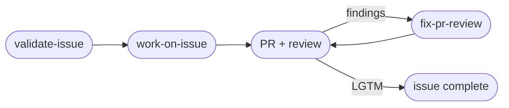

# rk-skills

Workflow skills for [Claude Code](https://claude.com/claude-code): GitHub issues, pull request (PR) review loops, docs syncing, and releases.

[](https://www.npmjs.com/package/rk-skills)

A skill is a reusable instruction file that teaches Claude Code one job (file an issue, cut a release). Trigger one by name and Claude follows its steps.

## Skills

Most workflow skills come in two forms: a **base** skill that does one step and stops, and a **`-loop`** variant that continues through review and re-review until the PR is approved.


```mermaid
flowchart LR
    A([validate-issue]) --> B([work-on-issue])
    B --> C([PR + review])
    C -- findings --> D([fix-pr-review])
    D --> C
    C -- LGTM --> E([issue complete])
```

Issues carry a **complexity score** (`C0` to `C100`) in the title and a `fableplan: yes|no` signal on the first line. The score routes the validate model, the build model and effort, and the first reviewer; `validate-issue` step 6 owns the band table. `fableplan` is `yes` at score 71 or higher, and a Fable 5.1 plan is then posted before the build. "Fable" skills hand part of the work to a subagent on the Fable 5.1 model; it runs at `high` by default and at `xhigh` only when you ask for it.

### Issue skills

| Skill | What it does |
|-------|--------------|
| `new-issue` | Turns a bug, idea, or conversation into a complete GitHub issue. Checks claims against the code first, adds the score, the `fableplan` signal, and a plain-language summary. |
| `new-issue-loop` | Runs `new-issue`, then validates, implements, and drives the PR through review. Stops on a duplicate. |
| `validate-issue` | Fact-checks an issue against the code with file and line references, checks the approach, and rescores it. |
| `validate-issue-loop` | Runs `validate-issue`, applies the verdict's fixes to the issue, then hands off to `work-on-issue-loop`. |
| `github-issue-format` | Reference skill: the required issue format. Loaded before any issue is filed or edited. |
| `work-on-issue` | Implements an issue in an isolated git worktree, builds to any posted plan (newest wins, deviations named in the PR), verifies, and opens a PR that closes the issue. An optional `targetBranch` replaces the default branch as worktree and PR base. |
| `work-on-issue-loop` | Runs `work-on-issue`, triggers the first review, then delegates to `fix-pr-review-loop` until the PR gets an LGTM. |
| `issueplan` | Plans and builds on the session's own model with no subagent. For an issue it posts the plan and asks whether to build. |

### PR review skills

| Skill | What it does |
|-------|--------------|
| `fix-pr-review` | Reads every unaddressed review comment, inline thread, and failing check, re-checks each against the code, fixes what holds up, resolves merge conflicts, replies point by point, and requests a fresh review from `@claude` (or `@codex` with a `codex` argument). |
| `fix-pr-review-loop` | Repeats `fix-pr-review` after every review until approval. After 5 rounds it accepts the first LGTM even with non-blocking notes. Escalates when 4 or more cycles keep raising blocking findings in code the loop itself added. |
| `pr-review` | Reference skill: the required review comment format (verdict line, findings, materiality filter, completeness passes that gate `LGTM`). Loaded before a review is written. |

### Docs and release skills

| Skill | What it does |
|-------|--------------|
| `sync-docs` | Updates `CLAUDE.md`, `AGENTS.md`, `SKILL.md`, and `README.md` to match what recent commits changed. |
| `create-release` | Bumps the package version, tags it, and publishes a GitHub release with generated notes. |
| `sync-docs-release` | Runs `sync-docs`, lands the doc changes on a PR, asks whether to merge, then runs `create-release`. |

### Fable-driven skills

| Skill | What it does |
|-------|--------------|
| `fableplan` | A Fable 5.1 subagent writes an implementation plan, posts it to the issue, and asks whether to build now. |
| `fable-new-issue` | `new-issue` drafted by a read-only Fable 5.1 subagent; your session spot-checks and files it. |
| `fable-new-issue-loop` | Runs `fable-new-issue`, then drives the issue to a reviewed PR. |
| `fable-validate` | `validate-issue` run on a Fable 5.1 subagent; your session presents the verdict and acts on it. |
| `fable-validate-loop` | Runs `fable-validate`, applies fixes, gets a Fable plan when score is 71 or higher or the code is safety-critical, then drives to a reviewed PR. |
| `fable-validate-fableplan-loop` | Same, with an unconditional Fable plan. |
| `fable-validate-fableplan` | Fable validates, fixes are applied, a Fable plan is posted, and it stops there. |
| `validate-fableplan-loop` | Validates on the session's own model, brings in Fable for planning at score 71 or higher or when safety-flagged, then drives to a reviewed PR. |
| `fableplan-work-on-issue` | Fable plans, `work-on-issue` builds and opens the PR. No validation, no review loop. |
| `fableplan-loop` | Fable plans, then `work-on-issue-loop` builds and drives review to approval. No validation. |
| `fable-advisor` | Your session builds; a persistent Fable 5.1 advisor writes the plan and answers mid-build consults, and a fresh Fable 5.1 reviewer issues a binding pre-commit verdict. |
| `fable-orchestrate` | Runs on Fable 5.1: splits the task into worker specs, dispatches Sonnet 5 workers, reviews each result, integrates one branch, and gets a binding verdict from a fresh Fable 5.1 reviewer before opening the PR. |
| `cli-dispatch` | Reference skill: how a build stamped on the Codex CLI or Cursor CLI reaches that CLI. Loaded by the Opus driver that `milestone-pipeline` dispatches for such an issue. |
| `fable-dispatch` | Reference skill: how every Fable skill reaches Fable 5.1 on the current harness, with the fallback ladder and its reporting. Loaded before any Fable subagent is dispatched. |

### App pipeline skills

The path from a raw app idea to a running multi-agent build, with a user checkpoint between stages:


```mermaid
flowchart LR
    A([app-prd]) --> B([prd-questions]) --> C([prd-to-issues]) --> D([execution-plan-review]) --> E([milestoneplan]) --> F([milestone-workflow])
```

| Skill | What it does |
|-------|--------------|
| `new-app-pipeline` | The orchestrator: stops at every stage boundary for review and re-enters mid-pipeline when artifacts exist. |
| `app-prd` | Turns an idea dump into a section-numbered `PRD.md` landed via worktree and PR. |
| `prd-questions` | Sweeps the PRD for open questions, asks them in batched multiple-choice form, and folds each answer into the owning section. |
| `prd-to-issues` | Breaks the PRD into dependency-ordered milestones and 15 to 25 scored issues, each with an `## Execution` block (`Depends on`, `Runs after`, build model, effort, fableplan, review trigger). |
| `execution-plan-review` | Renders the execution table from the issues, takes revisions ("11 should be medium", "build 275 with luna on codex at max"), rejects cycles, and writes changes back. |
| `milestoneplan` | Read-only: renders a milestone's plan as one table, one row per issue. Missing fields show as *missing*. |
| `milestone-workflow` | Builds dependency tracks, presents the run plan for approval, then runs `milestone-pipeline`: validate, plan, build, review loops, in-session merges, and the release. An optional `targetBranch` points every stage at that branch. |

The `workflows/milestone-pipeline.js` dynamic workflow validates the dependency graph, runs unrelated tracks concurrently, and builds hard successors from verified predecessor heads. Re-running a partial milestone skips closed issues and resumes open PRs through `fix-pr-review-loop`. Reviews run through the repo's `@claude` Action by default (`reviewMode: 'github'`), as in-session subagents with `reviewMode: 'subagent'`, or on the `@codex` Action with `reviewBot: 'codex'`. No subagent merges: each LGTM PR pauses as `awaiting_merge` and the orchestrating session squash-merges it at green CI on the reviewed head; a remaining PR that conflicts after a merge is resolved in-session, where the hand-resolved diff decides by behavior: a prose-only resolution keeps the standing LGTM, and a behavior change or any doubt, including agent-executed Markdown such as a `SKILL.md`, needs a `@claude sonnet review` before merging, then resumes; when every issue merges, the orchestrator runs `sync-docs-release`.

### Utility skills

| Skill | What it does |
|-------|--------------|
| `tldr` | Recaps the previous answer in ASD-STE100 (Simplified Technical English) under 55 words. |
| `wans` | Answers "what are next steps?" in ASD-STE100 as a numbered list, each step marked `You:` or `Me:`. |

### Review bot prerequisite

The PR-review skills (`fix-pr-review` and every `-loop` variant) need an automated reviewer that answers `@claude review` comments with an `LGTM` / `Needs Updates` verdict and structured findings. Without one, the loop skills detect its absence and stop. This repo ships:

- **Claude bundle: [`templates/claude-workflow/`](./templates/claude-workflow/)**: the least-privilege setup with `@claude review` (read-only), `@claude ...` fix routes on trusted-author PRs, `@claude` issue implementation, prompt files, and tests. See its [README](./templates/claude-workflow/README.md) for install and triggers.
- **Codex full bundle: [`templates/codex-workflow/`](./templates/codex-workflow/)**: the same routes driven by `openai/codex-action`. Needs `OPENAI_API_KEY`, your own GitHub App for the write routes, and the `CODEX_BOT_LOGIN` variable. See its [README](./templates/codex-workflow/README.md).
- **Codex minimal: [`templates/codex-review.yml`](./templates/codex-review.yml)**: review only; copy it into `.github/workflows/` and add `OPENAI_API_KEY`.

Claude and Codex are independent: separate workflows, concurrency groups, and secrets.

**The skills default to Claude.** They post `@codex` only when you select it: you say so, you pass `codex` to `/fix-pr-review`, a caller sets `reviewBot: 'codex'`, or the run started from an `@codex` comment. A cycle stays on the bot it picked.

**The reviewer follows the complexity band.** `@claude sonnet review` at C0 to C20, `@claude review` at C21 to C70, `@claude opus review effort:high` at C71 to C80, and `@claude fable review effort:high` at C81 or higher or with no score. A stamped `PR review:` trigger in an Execution block overrides the band. Every reviewer above `@claude review` reviews one blocking cycle only; each blocking re-review steps down one rung and stops at `@claude review`. A pass that addressed only non-blocking items re-triggers `@claude sonnet review`. With Codex, C21 and higher collapse onto `@codex review` and the cheap tier is `@codex luna review`. `skills/fix-pr-review/rereview-routing.md` owns the ladder.

**External build harnesses.** An Execution block can stamp `Build model: <Name> (Codex CLI)` or `<Name> (Cursor CLI)`, with an optional model id, and `milestone-pipeline` then runs the build and every fix pass through the `cli-dispatch` shim under an Opus 5 driver. Codex runs in its `workspace-write` sandbox. Cursor has no sandbox, so a Cursor build holds the driver's full shell rights and a `git status` diff is its only guard. The driver never substitutes a Claude build and reports the serving model only when the CLI names one.

Grab the Claude workflow directly:

```sh
mkdir -p .github/workflows && \
  curl -fsSL https://raw.githubusercontent.com/richkuo/rk-skills/main/templates/claude-workflow/workflows/claude.yml \
  -o .github/workflows/claude.yml
```

Then add the `CLAUDE_CODE_OAUTH_TOKEN` secret and install the Claude GitHub App. The workflow uses `self-hosted` runners; change `runs-on` and `runs_on` when you have none. See the bundle [Install](./templates/claude-workflow/README.md#install) and [Customization inputs](./templates/claude-workflow/README.md#customization-inputs) sections.

Also included:

- `CLAUDE.md`: the global instructions these skills are tuned for. `AGENTS.md` is a symlink to it.
- `commands/commit.md`: a `/commit` slash command.
- `docs/contract-inventory.md`: the shared pipeline rules the loop and validate skills must carry; `bun test` fails when a covered skill drops one.

## Install (from a clone)

`install.sh` symlinks every skill into `~/.claude/skills` (and `~/.codex/skills` when `~/.codex` exists), plus `CLAUDE.md`, `AGENTS.md`, the workflows, and the `/commit` command. Re-run after pulling.

```sh
./install.sh
```

## Install (with npx)

```sh
npx rk-skills
```

Copies the skills and workflow scripts into `~/.claude/`; add `--project` for the current repo's `.claude/`. Re-run to update. It does not install `CLAUDE.md`, the `/commit` command, or anything into `~/.codex`.

## Install (as a plugin)

```
/plugin marketplace add richkuo/rk-skills
/plugin install rk-skills@rk-skills
```

The plugin auto-discovers `skills/` and the `/commit` command and auto-updates; `CLAUDE.md` is a reference only. Restart Claude Code, then trigger any skill by name, e.g. `/fableplan <task>`. To install one skill, copy its directory's `SKILL.md` into `~/.claude/skills/<name>/`.

## License

MIT, see [LICENSE](./LICENSE).
