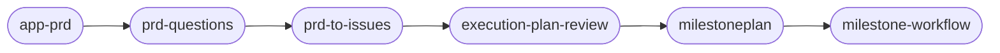

# rk-skills

Workflow skills for [Claude Code](https://claude.com/claude-code) — automate GitHub issues, PR review loops, docs syncing, and releases.

[](https://www.npmjs.com/package/rk-skills)

A "skill" is a reusable instruction file that teaches Claude Code how to do one job well (like filing a GitHub issue or cutting a release). You trigger one by name, and Claude follows its steps.

## Skills

Most workflow skills come in two forms: a **base** skill that does one step and stops, and a **`-loop`** variant that keeps going on its own — through code review and re-review — until the pull request (PR) is approved.


```mermaid
flowchart LR
    A([validate-issue]) --> B([work-on-issue])
    B --> C([PR + review])
    C -- findings --> D([fix-pr-review])
    D --> C
    C -- LGTM --> E([issue complete])
```

Several skills mention a **complexity score** (`C0`–`C100`): a model + effort routing signal in the issue title. **Capability** (which LLM / whether a Fable plan runs first) lives in the score band; **Volume** (how hard to push) lives in the depth inside the band — see `validate-issue` step 6. "Fable" skills hand part of the work to a subagent running on the Fable 5 model — a second Claude instance that plans, validates, or drafts while your main session does the building.

Every issue's first line also carries an explicit **`fableplan: yes|no`** signal, so later steps read the planning decision instead of re-deriving it from the score. It's `yes` at score ≥ 71 — a Fable 5 plan is posted before the build; the builder is Opus 5 at both plan bands: high at 71–80, xhigh at 81+. Effort runs `high`/`xhigh` for Opus and Sonnet builds. A Fable build exists only when the user explicitly directs it — no band defaults to one; stamped, it may also run at `medium` or, at the planner's discretion, `low` for issues lighter than the formula's own floor. Fable 5 never runs at `xhigh` — `high` is its ceiling on every stage (build, plan, validate, review, fix).

### Issue skills

| Skill | What it does |
|-------|--------------|
| `new-issue` | Turns a bug, idea, or conversation into a complete GitHub issue. Checks the claims against the actual code first, adds a complexity score, an explicit `fableplan` signal, and a short plain-language summary anyone can read, and never files a half-empty stub. |
| `new-issue-loop` | Runs `new-issue`, then automatically validates the new issue, implements it, and drives the PR through review — one command from idea to reviewed PR. Stops early if it finds a duplicate issue. |
| `validate-issue` | Fact-checks an existing issue: verifies every claim against the real code (with file and line references), and checks that the proposed approach is feasible and self-consistent. When the issue's `fableplan` signal is `yes`, it offers a Fable 5 plan as one of the reply options and leaves the call to you. |
| `github-issue-format` | Reference skill: the required format for creating or editing any GitHub issue (`[C<score>]` title, complexity rationale line ending in an explicit `fableplan: yes\|no` signal, complete-body rule, and a mandatory plain-language summary section every reader can understand). Loaded automatically before an issue is filed or edited. |
| `validate-issue-loop` | Runs `validate-issue`, applies any fixes the verdict calls for to the issue itself, then hands off to `work-on-issue-loop`. Stops instead if the issue is too large, infeasible, or already fixed elsewhere. |
| `work-on-issue` | Implements an issue end-to-end: scans the issue thread for a posted implementation plan and builds to it (newest wins; deviations must be named in the PR), in an isolated git worktree (a separate working copy, so your main checkout stays untouched), verifies it, and opens a PR that closes the issue. |
| `work-on-issue-loop` | Runs `work-on-issue` to implement and open the PR, triggers the first review, then delegates the review cycle to `fix-pr-review-loop` until the PR gets an approval ("LGTM" — looks good to me). |
| `issueplan` | Uses the current session's LLM to plan and build a task without a subagent. For an issue, it posts the plan and asks whether to build. A prose task proceeds to implementation and a PR after the plan. |

### PR review skills

| Skill | What it does |
|-------|--------------|
| `fix-pr-review` | Reads all unaddressed feedback on a PR — review comments, inline threads, and any failing CI checks — re-checks each point against the actual code (never blindly applies a suggestion), fixes what holds up, resolves any merge conflicts with the base branch, pushes, replies point-by-point, and requests a fresh review from `@claude` by default or from `@codex` when you pass a `codex` argument (e.g. `/fix-pr-review 123 codex`). |
| `fix-pr-review-loop` | Repeats `fix-pr-review` after every new review until the PR is approved, and won't stop on an approval while the PR is still unmergeable. After 5 review rounds it accepts the first approval even if minor, non-blocking notes remain. Escalates to the user instead of continuing when 4+ cycles keep raising blocking findings in code the loop itself added — evidence the PR is growing rather than converging. |
| `pr-review` | Reference skill: the required format for any PR review comment (verdict line, section structure, materiality filter, safety carve-out, verification method, and completeness passes — dimension sweep, event-state matrix, bug-class expansion, counterfactual closure — that gate `LGTM`). Every finding must include an ASD-STE100 plain-simple-English summary under 55 words; `Requires Human Review` items must also include a recommended proposed solution under 55 words. Loaded automatically before a review is written. |

### Docs & release skills

| Skill | What it does |
|-------|--------------|
| `sync-docs` | Updates `CLAUDE.md`, `AGENTS.md`, `SKILL.md`, and `README.md` to match what recent commits actually changed — in your main session, so you see every edit. |
| `create-release` | Cuts a version tag and publishes a GitHub release with generated notes in your main session, bumping the package version first so publish workflows fire correctly. |
| `sync-docs-release` | Runs `sync-docs` and `create-release` in sequence in your main session: sync docs, land the doc changes, then cut the release. The doc changes go onto a branch and a PR by default — it never commits them to your default branch — and it asks whether to merge that PR before releasing. |

### Fable-driven skills

| Skill | What it does |
|-------|--------------|
| `fableplan` | Has a Fable 5 subagent write an implementation plan; posts the plan to the related issue if there is one, then asks whether to build now or stop there. |
| `fable-new-issue` | Like `new-issue`, but a read-only Fable 5 subagent researches and drafts the issue; your main session spot-checks and files it. |
| `fable-new-issue-loop` | Runs `fable-new-issue`, then drives the new issue all the way to a reviewed PR automatically. |
| `fable-validate` | Like `validate-issue`, but the fact-checking runs on a Fable 5 subagent; your main session presents the verdict and acts on it. |
| `fable-validate-loop` | Runs `fable-validate`, applies issue fixes, gets a Fable plan (only when score ≥ 71, or touching safety-critical code), then drives to a reviewed PR. |
| `fable-validate-fableplan-loop` | Same as above, but the Fable plan is unconditional — every issue gets a posted plan before implementation, no matter how simple. |
| `fable-validate-fableplan` | The same chain without the build: Fable validates the issue, issue fixes are applied, and a Fable plan is always posted. It stops there — no worktree, no PR, no review loop. |
| `validate-fableplan-loop` | The hybrid: validates on your session's own model, but still brings in Fable for planning when score ≥ 71 or safety-flagged, then drives to a reviewed PR. |
| `fableplan-work-on-issue` | The trimmed chain: Fable 5 plans the issue and posts the plan, then `work-on-issue` builds it and opens a PR. No validation, no review loop — stops at the open PR. |
| `fableplan-loop` | Same as above, plus the review loop: after the Fable plan is posted, `work-on-issue-loop` builds it, opens the PR, and keeps fixing review findings until approval. No validation. |
| `fable-advisor` | Runs on your session's own model (Sonnet, typically). A persistent Fable 5 advisor writes the plan and stays available for mid-build consults (hard-to-reverse decisions, stuck signals, plan deviations); a separate fresh Fable 5 reviewer issues a binding pre-commit verdict. When a GitHub issue is referenced, it gates the issue and runs `work-on-issue`'s build-and-ship pipeline under the advisor instead of a duplicate flow. |
| `fable-orchestrate` | Runs on Fable 5. Decomposes the task into self-contained worker specs, dispatches Sonnet 5 workers to implement them, reviews each result inline, integrates everything into one branch, and gets a binding verdict from a fresh Fable 5 reviewer before opening the PR. |
| `fable-dispatch` | Reference skill: how every Fable skill reaches Fable 5 on the current harness — detects Claude Code positively, shells out to the Claude Code CLI on other harnesses (still Fable 5 at the intended effort, read-only), and only as a last resort falls back to another model with the downgrade reported. Loaded automatically before a Fable subagent is dispatched. |

### App pipeline skills

The full path from a raw app idea to a running multi-agent build, with a user checkpoint between every stage:


```mermaid
flowchart LR
    A([app-prd]) --> B([prd-questions]) --> C([prd-to-issues]) --> D([execution-plan-review]) --> E([milestoneplan]) --> F([milestone-workflow])
```

| Skill | What it does |
|-------|--------------|
| `new-app-pipeline` | The orchestrator: idea → PRD → resolved questions → issues → execution-plan review → milestone pre-flight → milestone workflow, stopping at every stage boundary for your review. Re-enterable mid-pipeline when artifacts already exist. |
| `app-prd` | Turns an idea dump into a complete, section-numbered `PRD.md` landed via worktree + PR (bootstrapping an empty repo when needed), then iterates on the same PR as you refine. |
| `prd-questions` | "Ask me all questions": sweeps the PRD for every open question and ambiguity, asks them in batched multiple-choice form with a recommended option, folds each answer into the owning spec section, and empties the Open Questions list. |
| `prd-to-issues` | Breaks the refined PRD into dependency-ordered milestones and 15–25 complete, complexity-scored issues, each stamped with an `## Execution` block: hard `Depends on` prerequisites, ordering-only `Runs after` constraints, build model, effort, whether a Fable plan comes first at high effort, and the `@claude` review trigger. |
| `execution-plan-review` | Renders the ordering/model/effort/fableplan/plan-effort table from the issues themselves, takes revisions ("11 should be medium", "12 runs after 11", "plan 17 at xhigh"), rejects cycles across both edge kinds, pushes back when a revision leaves a non-Fable build at `low`/`medium` effort, and writes changes back to the issues. |
| `milestoneplan` | Read-only: renders a milestone's execution plan as a single markdown table, one row per issue — number, description, complexity, dependencies, validate/build model and effort, fableplan, plan effort, and first-review trigger. Missing Execution-block fields show as *missing*, never guessed. Never edits an issue — hands fixes to `execution-plan-review` and the run to `milestone-workflow`. |
| `milestone-workflow` | Reads typed ordering fields before legacy prose, labels inferred edges, builds dependency tracks for a milestone, presents the run plan for approval (mandatory), then runs `milestone-pipeline` and reports PRs, blocked descendants, review outcomes, merges, and the release. |

Every new issue records direct predecessors as `**Depends on:** #<n>[, #<n>…] | none` for required code/product results and `**Runs after:** #<n>[, #<n>…] | none` for serialization without code inheritance. The `workflows/milestone-pipeline.js` dynamic workflow validates the full dependency graph before starting. Typed tracks use `after` for hard prerequisites and `runsAfter` for ordering-only predecessors. Unrelated tracks run concurrently; both successor types wait for stable predecessor review results. Hard successors build from verified predecessor heads, including a checked integration base for multiple heads, while ordering-only successors inherit no code. Legacy array tracks remain compatible and treat serial edges as hard dependencies. Re-running a partially completed milestone is safe: closed issues are skipped and issues that already have an open PR resume through `fix-pr-review-loop` instead of opening a duplicate; when a token target is set, a best-effort budget floor (`budgetFloor`, default 80k tokens) defers the remaining issues and returns partial results instead of dying at the hard ceiling, and each run posts its `runId` to the milestone's first issue so state survives losing the conversation. Reviews run through the repo's `@claude` Action by default (`reviewMode: 'github'`), or as in-session subagent reviewer/fixer cycles with `reviewMode: 'subagent'` (no GitHub Actions dependency); `reviewBot: 'codex'` routes github-mode reviews to the `@codex` Action instead, where the C21+ bands collapse onto Codex's single flagship and the cheap tier keeps a shorthand (`@codex luna review`) for both the C0–C20 first review and the non-blocking re-review. A `@claude fable review` or `@claude opus review` first review is first-review-only — the blocking re-reviews after it step down one rung each, fable through `@claude opus review` and then `@claude review`, and opus straight to `@claude review`. With merging on (`merge`, default `reviewLoop`), no subagent merges: the run pauses each LGTM PR as `awaiting_merge`, the orchestrating session squash-merges it in-session at green CI on the pinned reviewed head (branch deleted, issue closed), then resumes with the merge recorded in `merged` as an `{issue, pr, merge_sha, issue_state}` record the run checks against the issue/PR pair it is gating — successors build from the updated base branch instead of stacking on unmerged heads; when every issue merges, the release stage (`release`, default `merge`) defers to the orchestrator, which runs `sync-docs-release` in-session to sync docs and publish a GitHub release. Bun regression tests execute the workflow through its async harness.

### Utility skills

| Skill | What it does |
|-------|--------------|
| `tldr` | Recaps the previous answer in ASD-STE100 (Simplified Technical English) under 55 words, one sentence per line. |

### Review bot prerequisite

The PR-review skills (`fix-pr-review`, all `-loop` variants) depend on an automated reviewer that responds to `@claude review` comments and answers in a specific format (an `LGTM` / `Needs Updates` verdict plus structured findings). This repo ships two Claude options plus a Codex twin of each:

- **Full bundle (recommended): [`templates/claude-workflow/`](./templates/claude-workflow/)** — the complete least-privilege setup: `@claude review` (read-only), any other `@claude ...` comment on a trusted-author PR (re-validate and fix all review feedback in place, folding in any extra text as additional scope), plain `@claude` asks on an issue (implement via the issue-workflow prompt), optional docs/release flows, prompt files, comment-patching scripts, and regression tests. The agent never executes the project's code in any mode (no test suites, builds, or scripts — CI owns checks). See its [README](./templates/claude-workflow/README.md) for install and triggers.
- **Minimal: [`templates/claude-review.yml`](./templates/claude-review.yml)** — a single review-only workflow; copy it into `.github/workflows/`, add an `ANTHROPIC_API_KEY` secret, and the bot and skills speak the same format out of the box. It resolves the `sonnet` / `opus` / `fable` shorthand that follows `@claude`, so band-routed triggers reach the right reviewer; it ignores an `effort:` suffix, which only the full bundle parses.
- **Codex full bundle: [`templates/codex-workflow/`](./templates/codex-workflow/)** — the same three routes, router, review contract, and install shape driven by `openai/codex-action` instead. It needs an `OPENAI_API_KEY` secret, your own GitHub App for the write routes (`CODEX_APP_ID` / `CODEX_APP_PRIVATE_KEY`, because that action mints no App token), and the `CODEX_BOT_LOGIN` repository variable. Its review route holds no write credential at all and runs the read-only Codex sandbox, which denies the agent network too, so the run body stages the pull request on disk first and a trusted step posts the result. See its [README](./templates/codex-workflow/README.md).
- **Codex minimal: [`templates/codex-review.yml`](./templates/codex-review.yml)** — the review-only Codex companion; copy it into `.github/workflows/` and add an `OPENAI_API_KEY` secret.

Claude and Codex are independent: separate workflow files, separate concurrency groups, separate secrets, and installing one changes nothing about the other.

**The skills default to Claude.** `fix-pr-review`, the `-loop` skills, and `milestone-workflow`'s github review mode post `@claude` even when `codex.yml` is installed. They post `@codex` only when Codex is explicitly selected — you say so, you pass `codex` to `/fix-pr-review`, a caller argument names it (`reviewBot: 'codex'`), or the run itself was started by an `@codex` GitHub comment. Once a cycle picks a bot, every re-review in that cycle stays on it.

**The reviewer follows the complexity band.** `fix-pr-review`, the `-loop` skills, `milestone-workflow`, and the Action prompts all pick the reviewer from the issue's or PR's `[C<score>]`: `@claude sonnet review` at C0–C20, `@claude review` at C21–C70, `@claude opus review` at C71–C80, and `@claude fable review effort:high` at C81+ or when no score is available. The reviewer escalates on its own, coarser scale: those boundaries fall on the validate/build band edges in `validate-issue` step 6, so each first-review row groups whole bands rather than cutting across them, and it is still a separate table, but each row must start on a band edge above, so a band change that moves an edge this table uses moves this table with it, while a band split that only adds a new edge leaves it unchanged; that skill owns both. A stamped `PR review:` trigger in an issue's Execution block overrides the band. **Every reviewer above the standard trigger reviews one blocking cycle only**, and each blocking re-review steps down one rung: a Fable cycle 1 posts `@claude opus review` then `@claude review`, and an Opus cycle 1 posts `@claude review` for every blocking re-review. Both ladders stop at `@claude review` and never drop to sonnet, and neither heavy trigger is ever repeated. Sonnet sits below the floor and takes no rung, so a Sonnet cycle 1 repeats its own trigger. That step-down keys to the reviewer that actually ran cycle 1, and the score band does not decide it, so a stamped Fable or Opus first review steps down at any score, and a pass that addressed only non-blocking items always drops to `@claude sonnet review` without consuming a rung. With Codex selected, the C21+ bands collapse onto a bare `@codex review`, while the C0–C20 band and the non-blocking re-review keep `@codex luna review`.

Without a review bot, the loop skills detect its absence and stop instead of waiting for a review that never arrives.

Grab the workflow directly into a repo:

```sh
mkdir -p .github/workflows && \
  curl -fsSL https://raw.githubusercontent.com/richkuo/rk-skills/main/templates/claude-review.yml \
  -o .github/workflows/claude.yml
```

Also included:

- `CLAUDE.md` — an example set of global instructions these skills are tuned for (attribution footers, complexity scores, the worktree+PR workflow). `AGENTS.md` is a symlink to it in this repo, so both files are one source of truth. Use it as a reference for your own `~/.claude/CLAUDE.md`.
- `commands/commit.md` — a `/commit` slash command for creating well-formed git commits.
- `docs/contract-inventory.md` — inventory of shared pipeline rules loop/validate skills must carry (review-cycle stop, score gate, duplicate/convergence and validation stops); Response Style limits point at `CLAUDE.md`/`AGENTS.md` instead of restating. `bun test` fails when a covered skill drops a required rule, so the family can't drift apart silently. The guards check the smallest marker that proves a rule is present (a threshold number, a stop keyword, a field name), and pin a sentence only where that sentence is itself the contract, so most wording edits do not break them.

## Install (from a clone)

If you work from a checkout of this repo, `install.sh` symlinks every skill into `~/.claude/skills` and, when `~/.codex` already exists on the machine, into `~/.codex/skills` as well. It also links `CLAUDE.md` into `~/.claude` and `AGENTS.md` into `~/.codex/AGENTS.md` (both point at the same file in this repo), plus workflows and the `/commit` command into `~/.claude` only. Re-run after pulling to pick up new or renamed skills.

```sh
./install.sh
```

## Install (with npx)

Copy every skill into your personal `~/.claude/skills/` with one command — no marketplace, no clone:

```sh
npx rk-skills
```

Add `--project` to install into the current repo's `.claude/skills/` instead. This path is copy-based — re-run it to update — whereas the plugin below auto-updates. It installs the **skills and any dynamic workflow scripts** (the `milestone-workflow` skill invokes a dynamic workflow script from `workflows/`, which lands in `~/.claude/workflows/`) into Claude destinations only; it does not link into `~/.codex`, install `CLAUDE.md` (the example global config), or the `/commit` command.

## Install (as a plugin)

This repo is a Claude Code plugin marketplace. In any Claude Code session:

```
/plugin marketplace add richkuo/rk-skills
/plugin install rk-skills@rk-skills
```

Claude Code auto-discovers everything under `skills/` (and the `/commit` command). `CLAUDE.md` is **not** installed by the plugin — treat it as a reference. Restart Claude Code (or start a new session), then trigger any skill by name, e.g. `/fableplan <task>`.

Prefer to install a single skill? Each is just a directory with a `SKILL.md`, so you can copy one in directly:

```sh
mkdir -p ~/.claude/skills/work-on-issue && \
  curl -fsSL https://raw.githubusercontent.com/richkuo/rk-skills/main/skills/work-on-issue/SKILL.md \
  -o ~/.claude/skills/work-on-issue/SKILL.md
```

## License

MIT — see [LICENSE](./LICENSE).
